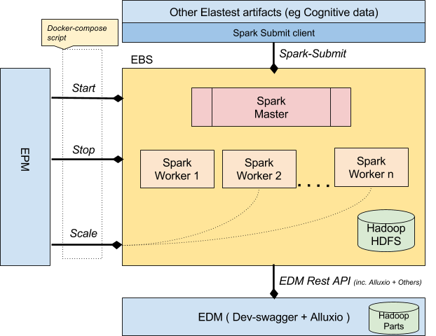

# Development documentation of the ElasTest Big data Service (EBS)

## Architecture

 

**Spark Master/Worker**: Spark uses a master/worker architecture. There is a driver that talks to a single coordinator called master that manages workers in which executors run.
	

**HDFS Client**: The native client for the HDFS filesystem.  The client is pre-configured with the details of the HDFS Cluster. It allows the communication of the Spark Master/Workers with the HDFS filesystem.

**Alluxio Client**: The native client for the Alluxio filesystem interface.  The client is pre-configured with the details of the Alluxio Cluster. It allows the communication of the Spark Master/Workers with the Alluxio filesystem interface which abstracts other filesystems (local/HDFS etc).

## Prepare development environment

This component depends on elastest-data-manager services. Please make sure elastest-data-manager component has been started before you start this component services. For instructions on how to start the elastest-data-manager component please refer to https://github.com/elastest/elastest-data-manager.

## Development procedure

### Accessing the spark-shell
Note: The Alluxio REST API is available at http://localhost:39999

You can try the following examples:

	# From main project folder
	
	# Get a shell inside Spark Master container
	docker exec -it spark-master /bin/bash

	# Change directory to spark project folder
	cd $SPARK_HOME

	# Upload file to Alluxio Local Filesystem
	alluxio fs copyFromLocal README.md /

	# Upload file to Alluxio HDFS
	alluxio fs copyFromLocal README.md /hdfs

	# List Alluxio HDFS root
	alluxio fs ls /hdfs
	# (You should be able to see the README.md file in the list)

	# Start spark-shell
	spark-shell
	
	# The following commands must be typed inside spark-shell at the "scala>" command prompt
	
	# Read text file from Alluxio Local Filesystem into Spark
	val s = sc.textFile("alluxio://edm-alluxio-master:19998/README.md")
	
	# Count the lines
	s.count()
	
	# Double each line
	val double = s.map(line => line + '\n' + line)
	
	# Save a new file from Spark to Alluxio Local Filesystem
	double.saveAsTextFile("alluxio://edm-alluxio-master:19998/README.double")
	
	# Read back the file we just saved (from Alluxio Local Filesystem into Spark)
	val d = sc.textFile("alluxio://edm-alluxio-master:19998/README.double")
	
	# Count the lines - Result should be double than that of s.count()
	d.count()
	
	# Exit the shell
	:quit
	
	# You can repeat the above example with HDFS. 
	# HDFS is mounted on the /hdfs Alluxio path
	# The only difference for the user is to prepend above paths with /hdfs

	# For example:
	
	# Read text file from Alluxio HDFS into Spark
	val s = sc.textFile("alluxio://edm-alluxio-master:19998/hdfs/README.md")
	
	# Save a new file from Spark to Alluxio HDFS
	double.saveAsTextFile("alluxio://edm-alluxio-master:19998/hdfs/README.double")
	
	# Finally, exit the Spark Master container
	exit

### Submit a batch job using spark-submit
You can try the following examples:

	# From main project folder
	
	# Get a shell inside Spark Master container
	docker exec -it spark-master /bin/bash

	# Change directory to spark project folder
	cd $SPARK_HOME

	# Example 1: Submit a Java/Scala job locally
	spark-submit --class org.apache.spark.examples.SparkPi --master spark://spark-master:7077 examples/jars/spark-examples_2.11-2.1.1.jar 100
	
	# After some processing messages, you will be able to see the output:
	Pi is roughly 3.1422263142226314
	
	# Example 2: Submit a Python job locally
	spark-submit --master spark://spark-master:7077 examples/src/main/python/pi.py 10
	
	# After some processing messages, you will be able to see the output:
	Pi is roughly 3.143703

	# Example 3: Submit a Java/Scala job to cluster reading a file stored in Alluxio	
	
	# First use alluxio client to copy the executable to hdfs
	alluxio fs copyFromLocal $SPARK_HOME/examples/jars/spark-examples_2.11-2.1.1.jar /hdfs/spark-examples.jar

	# Now call spark-submit providing the following:
	# 	deploy-mode cluster - The job will run in the cluster. Output can be seen from cluster GUI
	# 	The hdfs path to the executable jar
	# 	The alluxio path to the input file
	spark-submit  --deploy-mode cluster --master spark://spark-master:7077 --class org.apache.spark.examples.HdfsTest hdfs://edm-hdfs-namenode:9000/spark-examples.jar alluxio://edm-alluxio-master:19998/README.md

	# After you finish, exit the Spark Master container:
	exit

## Docker Images

The EBS docker images are the following:

	# ElasTest\ebs-spark: It contains the Apache spark open source cluster-computing framework
	# ElasTest\ebs: It contains the REST API which is responsible for the EBS health check.

## Continuous Integration

The ElasTest CI is served by the ElasTest Jenkins platform (https://ci.elastest.io/jenkins/).
Regarding the EBS (elastest-bigdata-service) there are two pipelines:

	# The first pipeline is named "ebs" and is responsible for the building and publishing of the ebs docker imnages. 
	  The ebs pipeline is consisted from the following stages:
		- Container Prep
		- Run EDM docker-compose
		- Build REST API image - Package
		- Build Spark Base image - Package
		- Run EBS docker-compose
		- Unit tests
		- Cobertura
		- publish
	
	# The second pipeline is named "ebs-e2e-test" and is responsible to run the end to end tests which check the component integration with the ElasTest platform.
	  The ebs-e2e-test is consisted from the following stages:
		- launch elastest
		- Container Prep
		- docker conf
		- E2E tests
		- release elastest

	
